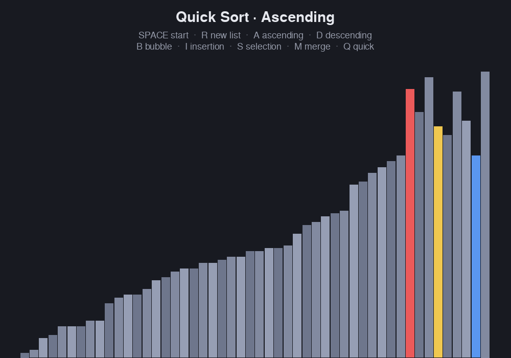

# Sorting Algorithm Visualizer

[](https://github.com/FuaadBashi/Sorting-Algorithm-visulaizer/actions/workflows/ci.yml)

Watch bubble, insertion, selection, merge and quick sort rearrange a list of bars in real time,
in ascending or descending order. Built with Python and Pygame.

<p align="center"></p>

## Highlights

- **Algorithms as generators.** Each sort is a Python generator that yields after every
  comparison or move, reporting which bars to highlight. The UI pulls one step per frame, so
  every algorithm animates at the same, steady pace, including recursive merge and quick sort,
  via `yield from`.
- **Algorithms separate from rendering.** `algorithms.py` has no Pygame dependency. The tests
  check every algorithm against Python's `sorted()` in both directions on randomised lists.
- **Colour-coded steps.** Yellow compares, red swaps, blue marks the pivot or key, and green shows
  an element in its final place.

| Algorithm | Best | Average | Worst | In place |
| --- | --- | --- | --- | --- |
| Bubble | O(n) | O(n²) | O(n²) | ✓ |
| Insertion | O(n) | O(n²) | O(n²) | ✓ |
| Selection | O(n²) | O(n²) | O(n²) | ✓ |
| Merge | O(n log n) | O(n log n) | O(n log n) | — |
| Quick | O(n log n) | O(n log n) | O(n²) | ✓ |

## Getting started

Requires Python 3.10+ and a desktop display.

```bash
git clone https://github.com/FuaadBashi/Sorting-Algorithm-visulaizer.git
cd Sorting-Algorithm-visulaizer
python3 -m venv .venv && source .venv/bin/activate
pip install -r requirements.txt
python main.py
```

| Key | Action |
| --- | --- |
| Space | Start sorting |
| R | New random list (also stops a sort) |
| A / D | Ascending / descending |
| B / I / S / M / Q | Bubble / insertion / selection / merge / quick sort |

## Tests

```bash
pip install pytest ruff
pytest
ruff format --check . && ruff check .
```
